<!-- 9eaa062a-530b-4ac2-b186-dd1889e46da7 -->
---
todos:
- id: "confirm-stack"
  content: "Confirm React + Django + PostgreSQL stack and hosting with school ICT"
  status: pending
- id: "phase1-foundation"
  content: "Phase 1: Auth, RBAC, users, academic structure (classes, subjects, enrollments)"
  status: pending
- id: "phase1-learning"
  content: "Phase 1: Assignments, submissions, grades (WW/PT/QA), attendance, materials"
  status: pending
- id: "phase1-comms-admin"
  content: "Phase 1: Announcements, notifications, enrollment pipeline, public site, admin dashboard"
  status: pending
- id: "phase2-deped"
  content: "Phase 2: SF9/conduct, grade publish workflow, registrar/principal dashboards, schedule, parent portal"
  status: pending
- id: "phase3-advanced"
  content: "Phase 3: Messaging, guidance cases, quizzes, push notifications, LIS exports, AI assist"
  status: pending
  isProject: false
---
# Kiwalan National High School — School Management & Learning Portal
## Professional Software Planning Document

**Document version:** 1.0  
**School:** Kiwalan National High School (KNHS), Iligan City, Lanao del Norte  
**Prepared for:** Development team implementation in [`Website Official`](C:\Users\dragon\Desktop\Website Official)  
**Recommended stack:** React 18 + Vite + Tailwind CSS (frontend) · Django 5 + DRF + PostgreSQL (backend) · Redis (WebSockets/cache) · Supabase/S3-compatible storage (files)

> **Foundation note:** [`Website Official`](C:\Users\dragon\Desktop\Website Official) is currently an empty project shell. A prior KNHS prototype exists at `AI-made Website` (React + Django). This blueprint treats **Website Official as a greenfield rebuild** that reuses proven DepEd patterns (WW/PT/QA grading, SF9 report cards, enrollment workflows) while simplifying navigation, expanding staff roles, and improving maintainability.

---

## 1. System Overview

### Project Vision
Build the **Official Digital Campus** of Kiwalan National High School — a unified platform where learners, teachers, and school staff manage academics, communication, and administration in one secure, DepEd-compliant system accessible on mobile and desktop.

### Objectives
| # | Objective | Success Metric |
|---|-----------|----------------|
| O1 | Digitize core academic workflows (classes, assignments, grades, attendance) | 90%+ teachers using portal weekly within 1 semester |
| O2 | Reduce manual SF9/report card preparation time | Adviser SF9 generation under 15 min per class per quarter |
| O3 | Centralize school communication | All official announcements delivered in-app with read receipts |
| O4 | Streamline enrollment and records | End-to-end enrollment trackable without paper follow-ups |
| O5 | Provide role-appropriate dashboards | Each role reaches primary task in ≤ 2 clicks from login |
| O6 | Meet DepEd data and security expectations | Audit trail, LRN integrity, role-based access, data export for LIS |

### Target Users
| User Group | Approx. Count (typical SHS) | Primary Device |
|------------|---------------------------|----------------|
| Students (Grades 7–12) | 800–1,500 | Mobile |
| Teachers | 40–80 | Mobile + Desktop |
| Class Advisers | 20–40 (subset of teachers) | Desktop |
| School Administrator / ICT | 2–5 | Desktop |
| Principal | 1 | Desktop + Mobile |
| Guidance Office | 2–4 | Desktop |
| Registrar | 1–3 | Desktop |
| Parents/Guardians (Phase 2) | 1,000+ | Mobile |

### Core Problems Solved
- **Fragmented tools** — Replaces spreadsheets, Messenger groups, and paper forms with one system
- **Grade inconsistency** — Enforces DepEd transmutation, WW/PT/QA weights, and quarter locking
- **Communication gaps** — Targeted announcements by grade, strand, class, or role
- **Enrollment chaos** — Online application, document upload, status tracking, registrar review
- **Records burden** — Automated attendance rollups, SF9 drafts, class lists, and exportable reports
- **Accountability** — Audit logs for grade changes, enrollment decisions, and admin actions

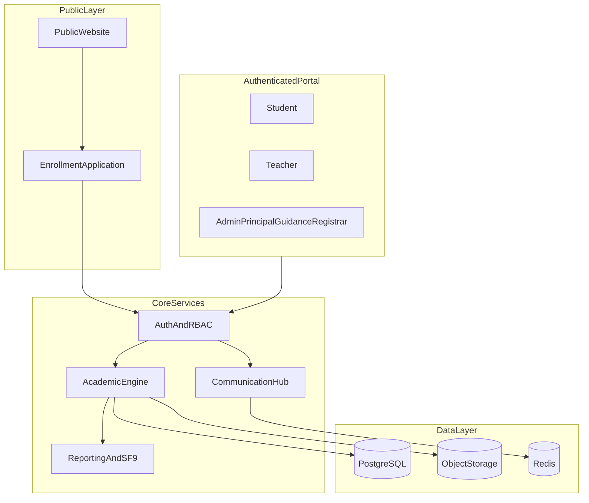

---

## 2. User Roles

### Role Hierarchy & Overlap
- **Teacher** and **Adviser** share a base teacher account; `is_adviser` flag on `Classroom` grants advisory features
- **School Administrator** has full system config; **Principal** has read-heavy oversight + approval workflows
- **Registrar** owns enrollment and permanent records; **Guidance** owns learner support cases and counseling notes

### 2.1 Student
| Aspect | Detail |
|--------|--------|
| **Permissions** | Read own grades (when published), submit assignments, view class materials, mark announcements read, message teachers (policy-controlled) |
| **Responsibilities** | Join classes via code, submit work on time, view schedule and grades |
| **Accessible Features** | Dashboard, My Classes, Assignments, Grades, Schedule, Materials, Announcements, Messages, Calendar, Profile |

### 2.2 Teacher
| Aspect | Detail |
|--------|--------|
| **Permissions** | CRUD on own classes/subjects, create assignments, input grades (subject scope), mark attendance, upload materials, post class announcements |
| **Responsibilities** | Deliver instruction digitally, grade submissions, maintain class records |
| **Accessible Features** | Dashboard, My Classes, Assignments, Grade Input, Attendance, Materials, Schedule, Announcements, Messages, Analytics (class-level) |

### 2.3 Adviser (Teacher + Advisory Scope)
| Aspect | Detail |
|--------|--------|
| **Permissions** | All Teacher permissions + manage advisory class roster, input conduct/core values, generate SF9 drafts, publish class-level reports, view advisory analytics |
| **Responsibilities** | Homeroom management, SF9 preparation, parent coordination, class-level attendance summary |
| **Accessible Features** | Everything in Teacher + **Advisory Class**, **Conduct Ratings**, **SF9 Preview**, **Class Roster Management** |

### 2.4 School Administrator
| Aspect | Detail |
|--------|--------|
| **Permissions** | Full user CRUD, system settings, academic calendar, master schedules, enrollment approval, grade unlock, website CMS, backups, audit access |
| **Responsibilities** | System operation, user provisioning, configuration, data integrity |
| **Accessible Features** | All modules except Principal-only approval queues (can co-admin if granted) |

### 2.5 Principal
| Aspect | Detail |
|--------|--------|
| **Permissions** | Read-all analytics, approve grade publication school-wide, approve enrollment batches, view audit logs, official announcements school-wide, limited user suspension |
| **Responsibilities** | Academic oversight, policy enforcement, official communications |
| **Accessible Features** | Executive Dashboard, School Analytics, Approval Center, Announcements, Reports, Audit (read), Settings (read) |

### 2.6 Guidance Office
| Aspect | Detail |
|--------|--------|
| **Permissions** | View student profiles (limited PII), counseling case notes (guidance-only), referral tracking, read attendance/grade summaries, schedule appointments |
| **Responsibilities** | Learner welfare, counseling, behavioral support |
| **Accessible Features** | Guidance Dashboard, Student Lookup, Case Notes, Referrals, Appointments, Announcements (guidance-targeted) |

### 2.7 Registrar
| Aspect | Detail |
|--------|--------|
| **Permissions** | Enrollment pipeline management, LRN validation, student master records, transfers, SF10-related data, class section assignment, document verification |
| **Responsibilities** | Admissions records, permanent records, sectioning support |
| **Accessible Features** | Registrar Dashboard, Enrollment Queue, Student Records, Document Review, Section Assignment, Export/LIS Prep |

### 2.8 Parent/Guardian (Phase 2 — Recommended)
| Aspect | Detail |
|--------|--------|
| **Permissions** | Read linked child grades (published), attendance summary, announcements, calendar |
| **Responsibilities** | Monitor learner progress, acknowledge notices |
| **Accessible Features** | Parent Dashboard, Child Grades, Attendance, Announcements, Messages (teacher-only) |

### Permission Matrix (Summary)

| Feature | Student | Teacher | Adviser | Admin | Principal | Guidance | Registrar |
|---------|---------|---------|---------|-------|-----------|----------|-----------|
| View published grades | Own | Own classes | Advisory + classes | All | All | Summary | All |
| Input subject grades | — | Own subjects | Own subjects | Override | — | — | — |
| SF9 / conduct | — | — | Advisory | View | Approve | View | View |
| Attendance mark | — | Own classes | Advisory | All | View | View | View |
| Assignments | Submit | CRUD | CRUD | View | View | — | — |
| Enrollment | Apply | — | — | Manage | Approve | — | **Own** |
| User management | Profile | Profile | Profile | Full | Limited | Lookup | Records |
| System settings | — | — | — | Full | Read | — | — |
| Audit logs | — | — | — | Full | Read | — | — |

---

## 3. Feature Inventory

**Legend:** MVP = Phase 1 · P2 = Phase 2 · P3 = Phase 3 · OPT = Optional

### Core Features
| Feature | Phase | Notes |
|---------|-------|-------|
| JWT auth + refresh tokens + role-based routing | MVP | httpOnly cookie refresh recommended |
| User profiles (LRN, grade level, employee ID) | MVP | |
| Account approval & password reset (OTP) | MVP | |
| Role-specific dashboards | MVP | |
| Academic year / quarter / semester settings | MVP | |
| Classrooms (grade + section + strand for SHS) | MVP | |
| Class join via code (student) | MVP | |
| Subject catalog & class-subject-teacher assignment | MVP | |
| Notifications (in-app) | MVP | |
| Profile & account settings | MVP | |
| Force password change on first login | MVP | |
| Maintenance mode toggle | MVP | Admin only |

### Academic Features
| Feature | Phase | Notes |
|---------|-------|-------|
| Assignment create / edit / publish | MVP | |
| File submission & late detection | MVP | |
| Submission grading & feedback | MVP | |
| Learning materials upload (modules, DLL, etc.) | MVP | |
| Attendance (present/absent/late/excused) | MVP | |
| DepEd grade input (WW/PT/QA + transmutation) | MVP | |
| Quarterly grade computation | MVP | |
| Grade publication workflow (draft → publish) | MVP | |
| Student grade view + report card PDF | MVP | |
| Class schedule / timetable | P2 | Room + conflict detection |
| SF9 auto-generation (JHS + SHS templates) | P2 | MATATAG-aware templates for G7 |
| Conduct / core values ratings (SF9 section) | P2 | Adviser role |
| Grade quarter locking | MVP | Admin unlock |
| Online quizzes (auto-graded MCQ) | P3 | |
| Rubric-based grading | P3 | |

### Communication Features
| Feature | Phase | Notes |
|---------|-------|-------|
| School & class announcements | MVP | Audience targeting |
| Announcement attachments | MVP | |
| Read receipts | P2 | |
| Direct messaging (teacher ↔ student) | P2 | Policy-controlled |
| Real-time notifications (WebSocket) | P2 | |
| Push notifications (FCM) | P3 | |
| Parent messaging | P3 | Phase 2 parent portal dependency |
| Message moderation / reporting | P2 | |

### Administrative Features
| Feature | Phase | Notes |
|---------|-------|-------|
| Student management (CRUD, bulk import) | MVP | |
| Teacher management | MVP | |
| Enrollment online application | MVP | Public form |
| Enrollment review workflow | MVP | Registrar + Admin |
| Enrollment status tracking (public) | MVP | |
| Document upload & verification | MVP | |
| Section / class assignment | MVP | |
| Public website (DepEd-style) | MVP | Home, About, Contact, Portals |
| Website CMS | P2 | Admin editable sections |
| Fee tracking | OPT | If school requires |
| User bulk import/export (CSV) | P2 | |
| Parent account linking | P2 | |
| Counseling case management | P2 | Guidance |
| Referral & appointment scheduling | P3 | Guidance |
| Audit logs | MVP | |
| Database backup metadata | P2 | |
| API request logging | OPT | |

### Reporting Features
| Feature | Phase | Notes |
|---------|-------|-------|
| Class grade summary export (Excel/PDF) | MVP | |
| Attendance summary per class | MVP | |
| Enrollment statistics | MVP | |
| School-wide analytics dashboard | P2 | Principal/Admin |
| SF9 bulk PDF export | P2 | |
| SF5/SF10 prep exports | P3 | LIS alignment |
| Custom report builder | OPT | |
| Teacher performance analytics | P3 | |

### Future AI Features
| Feature | Phase | Notes |
|---------|-------|-------|
| AI assignment description generator | P3 | Teacher assist |
| AI feedback suggestions on essays | P3 | Human review required |
| At-risk student early warning (attendance + grades) | P3 | Guidance/Adviser |
| Chatbot for enrollment FAQ (public site) | P3 | |
| Natural language announcement drafting | OPT | |
| Automated schedule conflict resolution suggestions | OPT | |

---

## 4. Information Architecture

### Design Principles
- **Task-first navigation** — Group by what users do daily, not by database tables
- **Max 2 levels** in sidebar; use tabs inside pages for sub-views
- **Merge** pages that differ only by filter (e.g., "Grade Input" and "Grade Management" → single **Grades** hub with role-based tabs)
- **Separate** public marketing site from authenticated portal (different layouts)

### Public Website Navigation (Top Nav)
```
Home | About (Mission, Vision, Faculty) | Academics (K-12, Senior High) | Admissions (Enroll, Track Status) | News & Events | Contact | Portal Login
```

### Authenticated Portal — Sidebar by Role

#### Student Sidebar
```
Dashboard
My Classes          → [Class Detail: Stream | Assignments | Materials | People]
Assignments         → (aggregated across classes)
Grades
Schedule
Materials
Announcements
Messages              (P2)
Calendar
─────────────
Profile | Settings
```

#### Teacher Sidebar
```
Dashboard
My Classes          → [Class Detail: Stream | Assignments | Attendance | Grades | Materials | People]
Assignments         → (quick create)
Grades                → tabs: Input | Submissions | Publish Status
Attendance
Materials
Schedule              (P2)
Announcements
Messages              (P2)
Calendar
─────────────
Profile | Settings
```

#### Adviser (additional items)
```
Advisory Class        → Roster | Conduct | SF9 Preview | Class Attendance Summary
```

#### School Administrator Sidebar
```
Dashboard
People                → Students | Teachers | Staff Accounts
Enrollment            → Applications | Documents | Section Assignment
Academics             → Classes | Subjects | Assignments | Schedules (P2)
Grades & Records      → Grade Oversight | Unlock Requests | Reports
Attendance            → School Overview
Communication         → Announcements | Messages | Moderation (P2)
Reports & Analytics
Website               → Content Editor (P2)
System                → Settings | Audit Logs | Backups (P2)
```

#### Principal Sidebar (simplified oversight)
```
Executive Dashboard
Approval Center       → Grade Publication | Enrollment Batches
School Analytics
Announcements
Reports
Audit Logs (read)
```

#### Guidance Sidebar
```
Dashboard
Student Lookup
Cases & Notes         (P2)
Referrals             (P3)
Appointments          (P3)
Announcements
```

#### Registrar Sidebar
```
Dashboard
Enrollment Queue
Student Records
Document Verification
Section Assignment
Exports               → Class Lists | LIS Prep (P3)
```

### Pages to Merge (Reduce Complexity)
| Merge Into | Retire Separate Pages |
|------------|----------------------|
| **Grades** (tabbed) | Grade Input, Grade Management, Grade Reports |
| **My Classes → Class Detail** | Class Members, Class Stream, per-class attendance |
| **People** (admin) | Separate Students/Teachers top-level if only CRUD differs |
| **Enrollment** (tabbed) | Enrollment Management + Tracking + Document Review |
| **Settings** (tabbed) | Academic Year, Branding, Security, Notifications prefs |
| **Announcements** (single) | News vs portal announcements via audience filter, not separate routes |

### Dashboard Structure (All Roles)
```
[Welcome + Date/Quarter Banner]
[Quick Actions Row — 3–4 primary buttons]
[KPI Cards Row — 3–4 metrics]
[Main Content: 2-column]
  Left (2/3): Priority widgets (tasks, deadlines, pending items)
  Right (1/3): Recent activity feed + upcoming calendar
```

### Classroom Structure (Class Detail Page)
```
Class Header: Name | Adviser | Join Code (teacher) | Quarter
Tabs: Stream | Assignments | Materials | Grades | Attendance | People
```
- **Stream** = announcements + pinned items + recent activity (replaces separate "class feed")
- **Assignments** and **Materials** stay separate (different workflows)

### Settings Structure
```
Settings
├── Profile (name, photo, contact)
├── Account (password, 2FA P3)
├── Notifications (in-app, email, push P3)
├── Preferences (language: EN/Filipino P3, theme)
└── [Admin only] School Settings
    ├── Academic Calendar
    ├── Branding (logo, colors)
    ├── Enrollment Toggle
    └── Security Policies
```

---

## 5. User Flows

### 5.1 Student Joins Class
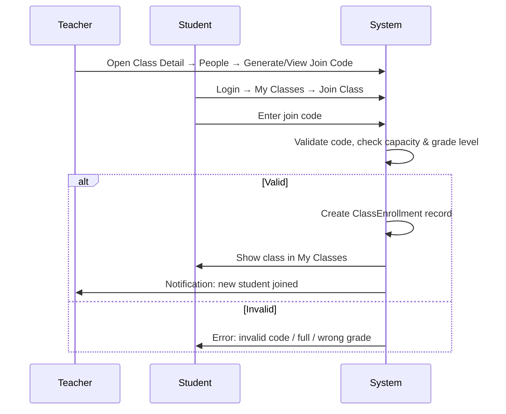

**Steps:**
1. Teacher creates class (or uses auto-created advisory class) → system generates 6–8 char join code
2. Student navigates **My Classes → Join Class**, enters code
3. System validates: active code, matching grade level, capacity, not already enrolled
4. `class_enrollments` record created; student sees class tabs
5. Teacher receives in-app notification

**Edge cases:** Expired code (teacher regenerates); student transferred mid-year (registrar reassigns, code optional)

---

### 5.2 Teacher Creates Assignment
1. Teacher → **My Classes** → select class → **Assignments** tab → **Create Assignment**
2. Form: title, description (rich text), due date/time, points, allow late submission, attachments (optional template)
3. Choose: **Save Draft** or **Publish**
4. On publish: system creates `assignments` record, notifies enrolled students
5. Assignment appears in class Stream + student **Assignments** aggregator

---

### 5.3 Student Submits Assignment
1. Student → notification or **Assignments** → open assignment detail
2. Upload file(s) or enter text response (if enabled)
3. System validates: enrolled, before deadline (or late flag if allowed)
4. Creates `submissions` record (status: submitted / late)
5. Confirmation shown; submission locked unless teacher allows resubmit
6. Teacher notified

---

### 5.4 Teacher Grades Submission
1. Teacher → class **Assignments** → select assignment → **Submissions** list
2. Open student submission → view files → enter score + written feedback
3. Save grade → updates `submissions.score`, `submissions.graded_at`
4. Optionally sync score to gradebook (`grades` table) if assignment weight configured (P2)
5. Student notified; grade visible based on publication rules

---

### 5.5 Attendance Workflow
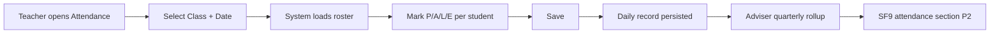

**Daily flow:**
1. Teacher → **My Classes** → class → **Attendance** (or global Attendance with class picker)
2. Default date = today (Asia/Manila); load roster
3. Bulk actions: Mark All Present, then adjust exceptions
4. Save → `attendance_records` (unique: class + student + date)
5. Admin/Adviser views summary reports

**Quarterly (Adviser):** System aggregates days present/absent/late per quarter for SF9

---

### 5.6 Announcement Workflow
1. **Author** (Teacher/Admin/Principal) → **Announcements → Create**
2. Fields: title, body, priority (normal/urgent), audience (school / grade / strand / class / role), attachments, schedule publish (optional)
3. **Teacher scope:** limited to own classes + grade level
4. **Principal/Admin:** school-wide
5. On publish: notifications sent to matching users; appears in dashboard feed + class Stream (if class-scoped)
6. Students mark as read (P2: track read receipts)

---

### 5.7 Grade Publishing Workflow
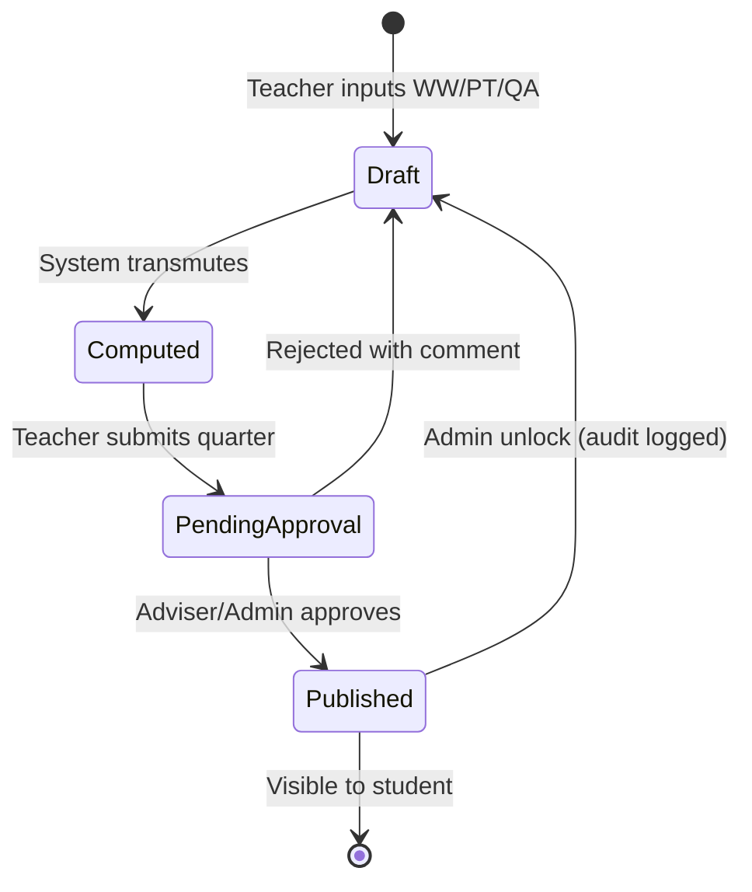

1. Teacher enters component scores per subject per quarter
2. System computes transmuted grade via DepEd table
3. Teacher submits quarter grades → status `pending_approval`
4. **Adviser** reviews advisory class; **Principal** optional school-wide approval for final quarter
5. On publish → students and parents (P2) see grades; PDF report card available
6. Admin can unlock with mandatory reason (audit log)

---

## 6. Database Architecture

### 6.1 Core Entities & Relationships
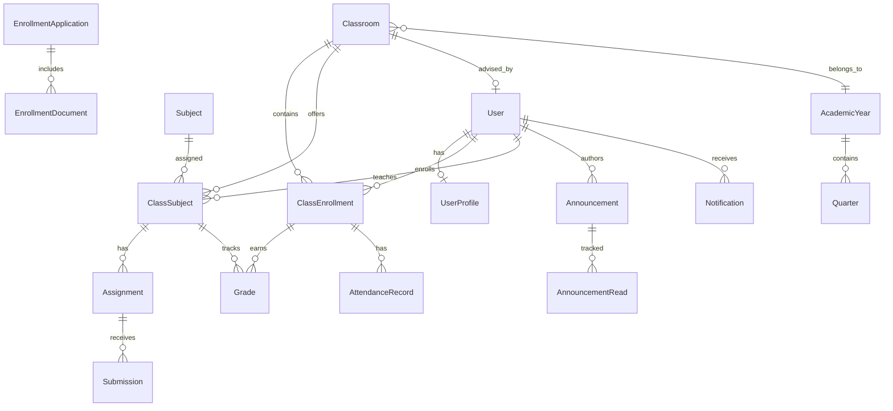

### 6.2 Table Definitions

#### Identity & Access
| Table | PK | Key Columns | FK | Purpose |
|-------|-----|-------------|-----|---------|
| `users` | `id` (UUID) | email, password_hash, role, is_active, is_verified, must_change_password | — | Central auth account |
| `user_profiles` | `user_id` | first_name, last_name, lrn, grade_level, strand, employee_id, phone, avatar_url | `users.id` | Role-specific identity; 1:1 with users |
| `otp_tokens` | `id` | user_id, code, purpose, expires_at | `users.id` | Email verification & password reset |
| `parent_student_links` | `id` | parent_user_id, student_user_id, relationship | both → `users.id` | P2 parent portal |

#### Academic Structure
| Table | PK | Key Columns | FK | Purpose |
|-------|-----|-------------|-----|---------|
| `academic_years` | `id` | label, start_date, end_date, is_current | — | SY 2025-2026 etc. |
| `quarters` | `id` | academic_year_id, number, name, start_date, end_date | `academic_years.id` | Q1–Q4 tracking |
| `subjects` | `id` | name, code, grade_level, strand, is_active | — | Master subject catalog |
| `classrooms` | `id` | name, grade_level, section, strand, adviser_id, academic_year_id, join_code, capacity | `users.id`, `academic_years.id` | Homeroom/advisory unit |
| `class_subjects` | `id` | classroom_id, subject_id, teacher_id, ww_weight, pt_weight, qa_weight | classroom, subject, user | Subject taught in a class |
| `class_enrollments` | `id` | classroom_id, student_id, enrolled_at, status | classroom, user | Student-class membership |
| `schedules` | `id` | class_subject_id, day, time_slot, room | `class_subjects.id` | P2 timetable |

#### Learning & Assessment
| Table | PK | Key Columns | FK | Purpose |
|-------|-----|-------------|-----|---------|
| `assignments` | `id` | class_subject_id, title, description, due_at, max_score, status, allow_late | `class_subjects.id` | Teacher-created work |
| `submissions` | `id` | assignment_id, student_id, file_urls, text_response, score, feedback, submitted_at, is_late | assignment, user | Student work |
| `grades` | `id` | class_enrollment_id, class_subject_id, quarter_id, ww, pt, qa, transmuted, status | enrollment, class_subject, quarter | DepEd grade records |
| `grade_publish_events` | `id` | grade_id, action, actor_id, reason, created_at | grade, user | Audit trail for grade changes |
| `learning_materials` | `id` | class_subject_id, title, type, file_url, uploaded_by | class_subject, user | Modules, DLL, etc. |
| `attendance_records` | `id` | class_enrollment_id, date, status, recorded_by | enrollment, user | Daily attendance |
| `conduct_ratings` | `id` | class_enrollment_id, quarter_id, core_value, behavior, rating | enrollment, quarter | P2 SF9 conduct section |

#### Communication
| Table | PK | Key Columns | FK | Purpose |
|-------|-----|-------------|-----|---------|
| `announcements` | `id` | author_id, title, body, audience_type, audience_ref_id, priority, published_at | `users.id` | Targeted comms |
| `announcement_attachments` | `id` | announcement_id, file_url, filename | `announcements.id` | Files on announcements |
| `announcement_reads` | `id` | announcement_id, user_id, read_at | announcement, user | P2 read receipts |
| `notifications` | `id` | user_id, type, title, body, link, is_read, created_at | `users.id` | In-app alerts |
| `messages` | `id` | sender_id, recipient_id, body, sent_at, thread_id | users | P2 direct messages |

#### Enrollment & Records
| Table | PK | Key Columns | FK | Purpose |
|-------|-----|-------------|-----|---------|
| `enrollment_applications` | `id` | tracking_number, applicant_data JSON, grade_level, strand, status, reviewed_by | user (nullable) | Public enrollment pipeline |
| `enrollment_documents` | `id` | application_id, doc_type, file_url, verified | `enrollment_applications.id` | Uploaded requirements |
| `enrollment_status_history` | `id` | application_id, status, notes, changed_by | application, user | Audit trail |

#### Guidance (P2)
| Table | PK | Key Columns | FK | Purpose |
|-------|-----|-------------|-----|---------|
| `guidance_cases` | `id` | student_id, counselor_id, case_type, status, opened_at | users | Counseling cases |
| `guidance_notes` | `id` | case_id, note, created_by, is_confidential | case, user | Session notes |

#### System
| Table | PK | Key Columns | FK | Purpose |
|-------|-----|-------------|-----|---------|
| `system_settings` | `key` | value JSON | — | Key-value config (branding, enrollment toggle) |
| `audit_logs` | `id` | actor_id, action, entity_type, entity_id, metadata, ip | `users.id` | Compliance & debugging |
| `website_content` | `id` | section_key, content JSON | — | P2 CMS blocks |

### 6.3 Key Indexes (Performance)
- `class_enrollments (student_id, classroom_id)` UNIQUE
- `attendance_records (class_enrollment_id, date)` UNIQUE
- `grades (class_enrollment_id, class_subject_id, quarter_id)` UNIQUE
- `users (email)` UNIQUE; `user_profiles (lrn)` UNIQUE where not null
- `classrooms (join_code)` UNIQUE
- `enrollment_applications (tracking_number)` UNIQUE

### 6.4 Why Each Table Group Exists
- **Identity split (`users` + `user_profiles`):** Keeps auth credentials separate from editable PII; simplifies parent linking and LRN rules
- **`class_subjects` junction:** One classroom has many subjects; each subject may have a different teacher and weight config
- **`grades` separate from `submissions`:** Not all graded work is digital assignments; WW/PT/QA come from multiple sources
- **`grade_publish_events`:** DepEd accountability — grade changes must be traceable
- **`enrollment_applications` JSON:** Applicant data varies by grade; avoids 40 nullable columns
- **`announcement_reads`:** Optional but cheap; enables "unread" badges and compliance tracking

---

## 7. UI/UX Strategy

### Brand Identity
| Token | Value | Usage |
|-------|-------|-------|
| Primary Purple | `#5E2A84` | Buttons, active nav, headers |
| Purple Light | `#7C3AED` | Hover, accents, links |
| DepEd Blue | `#0038A8` | Government header bar, official badges |
| Gold Accent | `#FCD116` | Highlights, awards, urgent badges |
| Neutral BG | `#F8F7FC` | Page background |
| Surface | `#FFFFFF` | Cards |
| Text Primary | `#1E1B2E` | Body text |
| Text Muted | `#6B7280` | Secondary labels |

### DepEd-Inspired Design Language
- **Header strip:** "Republika ng Pilipinas · Kagawaran ng Edukasyon · Lalawigan ng Lanao del Norte"
- **Official document styling** for PDF exports (SF9, class lists): serif headers, structured tables, signature blocks
- **Formal but approachable** tone in microcopy (Filipino + English support in P3)

### Layout System
- **Mobile-first responsive grid:** 4px base spacing unit
- **Breakpoints:** sm 640, md 768, lg 1024, xl 1280
- **Portal layout:** Collapsible sidebar (desktop) · bottom nav or hamburger (mobile)
- **Public site layout:** Top nav + DepEd header + footer with contact info

### Component System (Design Tokens + Reusable Components)
| Component | Spec |
|-----------|------|
| **Card** | White surface, 12px radius, subtle shadow `0 1px 3px rgba(94,42,132,0.08)`, 16–24px padding |
| **Primary Button** | Purple bg, white text, 8px radius, min-height 44px (touch target) |
| **Sidebar Item** | Icon + label, active = purple left border + light purple bg |
| **Data Table** | Sticky header, zebra rows, mobile → card list transformation |
| **Status Badge** | Color-coded: draft gray, pending amber, published green, late red |
| **Empty State** | Illustration + single CTA (e.g., "Join your first class") |
| **DepEd Header** | Fixed 32px strip above portal/public nav |

### Typography
- **Headings:** Inter or Poppins (600/700)
- **Body:** Inter (400/500)
- **Monospace (codes, LRN):** JetBrains Mono or system mono
- **Scale:** 12 / 14 / 16 / 18 / 24 / 32 px

### Spacing System
- Base unit: **4px** — use 4, 8, 12, 16, 24, 32, 48, 64

### Accessibility
- WCAG 2.1 AA contrast ratios (purple on white verified)
- Full keyboard navigation for sidebar and forms
- `aria-labels` on icon-only buttons
- Focus rings visible (2px purple outline)
- Reduced motion preference respected
- Screen reader announcements for grade publish and submission confirmations

---

## 8. Dashboard Strategy

### 8.1 Student Dashboard
**Widgets:**
| Widget | Content |
|--------|---------|
| Welcome Banner | Name, grade/section, current quarter |
| Quick Actions | Join Class, View Assignments, Check Grades |
| Due Soon | Assignments due in next 7 days (sorted by date) |
| Recent Grades | Last published quarter grades summary |
| Announcements | 3 latest school/class announcements |
| Today's Schedule | P2 — current day periods |
| Activity Feed | Submission graded, new material, new announcement |

**KPIs (cards):** Pending assignments · Overdue · Average grade (published) · Attendance rate (month)

---

### 8.2 Teacher Dashboard
**Widgets:**
| Widget | Content |
|--------|---------|
| Welcome + Quarter | Active academic period |
| Quick Actions | Create Assignment, Mark Attendance, Input Grades |
| Pending Tasks | Ungraded submissions count, unpublished grades |
| My Classes | Cards per class with enrollment count |
| Due Today | Assignments due + attendance not yet marked |
| Recent Activity | Submissions received, student join requests |
| Mini Analytics | Class avg grade trend (P2) |

**KPIs:** Total students · Pending grades · Submissions this week · Attendance completion rate

---

### 8.3 Administrator Dashboard
**Widgets:**
| Widget | Content |
|--------|---------|
| School Overview | Total students, teachers, active classes |
| Quick Actions | Add User, Review Enrollment, Post Announcement, Settings |
| Enrollment Pipeline | Pending / approved / rejected counts |
| Grade Publication Status | Quarters pending approval by grade level |
| System Health | Active users today, storage usage, last backup |
| Recent Audit | Last 10 admin actions |
| Alerts | Unverified accounts, failed login spikes |

**KPIs:** Enrollment rate · Attendance avg · Grade completion % · Active portal users

---

### 8.4 Principal Dashboard (Executive variant)
- All KPIs at school level with trend arrows vs last quarter
- **Approval Center** widget (top priority)
- Grade distribution charts by grade level
- Attendance heatmap by day
- No destructive quick actions — oversight focus

---

### 8.5 Registrar Dashboard
- Enrollment queue (new, under review, needs documents)
- Document verification backlog
- Recent section assignments
- Export quick actions

---

### 8.6 Guidance Dashboard (P2)
- Caseload summary
- Students flagged (attendance < 85%, failing 2+ subjects)
- Upcoming appointments

---

## 9. Development Roadmap

### Phase 1 — MVP Foundation (Priority: Critical · Complexity: High · ~10–14 weeks)
**Goal:** Core portal usable for daily teaching and learning

| Workstream | Deliverables | Dependencies |
|------------|--------------|--------------|
| Foundation | Django project, React app, auth, RBAC, CI | None |
| Users | Student/Teacher/Admin accounts, profiles, approval | Auth |
| Academics | Classrooms, subjects, join code, enrollments | Users |
| Assignments | Create, submit, grade | Class enrollments |
| Grades | WW/PT/QA input, transmutation, student view | Class subjects |
| Attendance | Daily marking, basic reports | Enrollments |
| Comms | Announcements (school + class), in-app notifications | Users |
| Materials | Upload/download per class | Class subjects |
| Admin | Student/teacher CRUD, settings, audit logs | Auth |
| Enrollment | Public apply + admin/registrar review | Auth |
| Public site | Home, About, Contact, Login, Enroll | None |
| UX | Purple DepEd theme, responsive layouts, role sidebars | Design tokens |

---

### Phase 2 — Operational Excellence (Priority: High · Complexity: Medium · ~8–10 weeks)
**Goal:** Full school-year operations including DepEd compliance artifacts

| Workstream | Deliverables | Dependencies |
|------------|--------------|--------------|
| Adviser/SF9 | Conduct ratings, SF9 PDF, attendance rollup | Phase 1 grades/attendance |
| Grade workflow | Submit → approve → publish pipeline | Phase 1 grades |
| Registrar | Dedicated dashboard, document verification, exports | Phase 1 enrollment |
| Principal | Executive dashboard, approval center | Grade workflow |
| Schedule | Timetable builder, student/teacher schedule view | Class subjects |
| Messaging | Direct messages, moderation | Notifications |
| Parent portal | Parent accounts, child linking, read-only grades | Published grades |
| Realtime | WebSocket notifications | Notifications |
| CMS | Editable public website content | Public site |
| Reports | School analytics, Excel/PDF exports | All Phase 1 data |

---

### Phase 3 — Advanced Features (Priority: Medium · Complexity: Medium · ~8 weeks)
**Goal:** Differentiation and staff productivity

- Push notifications (FCM)
- Online quizzes (auto-grade)
- Guidance case management
- SF10/LIS export prep
- At-risk student flags
- Rubric grading
- Filipino language UI
- AI-assisted feedback (optional, with human review)

---

### Phase 4 — AI & Optimization (Priority: Low · Complexity: High · ~6+ weeks)
**Goal:** Intelligent assistance and scale

- AI early warning system (attendance + grade trends)
- Enrollment FAQ chatbot (public)
- Custom report builder
- Performance optimization (caching, read replicas)
- Advanced analytics / predictive models

---

### Suggested Folder Structure (Website Official)
```
Website Official/
├── backend/
│   ├── config/              # Django settings, urls, asgi
│   ├── apps/
│   │   ├── accounts/        # users, profiles, auth
│   │   ├── academics/       # classes, subjects, grades, attendance
│   │   ├── learning/        # assignments, submissions, materials
│   │   ├── communications/  # announcements, notifications, messages
│   │   ├── enrollment/      # applications, documents
│   │   ├── guidance/        # P2 cases
│   │   └── system/          # settings, audit, cms
│   └── requirements.txt
├── frontend/
│   ├── src/
│   │   ├── components/      # ui, layout, deped-header
│   │   ├── features/        # domain modules (grades, classes, etc.)
│   │   ├── pages/
│   │   ├── hooks/
│   │   ├── styles/          # design tokens
│   │   └── routes/
│   └── package.json
└── docs/
    └── ARCHITECTURE.md        # This blueprint
```

---

## 10. Risks and Improvements

### Scalability Concerns
| Risk | Impact | Recommendation |
|------|--------|----------------|
| Single DB for all modules | Slow queries at 1,500+ students | Index aggressively; paginate all lists; archive old academic years |
| File storage growth | Disk cost | Object storage (Supabase/S3) with per-user quotas |
| WebSocket fan-out | Memory pressure | Redis channel layer; limit concurrent connections |
| PDF generation (SF9 bulk) | CPU spikes | Background job queue (Celery + Redis) |

### Security Concerns
| Risk | Impact | Recommendation |
|------|--------|----------------|
| Student PII exposure | Legal/reputational | Strict RBAC, field-level serializers per role, no PII in URLs |
| Grade tampering | Trust loss | Immutable audit log, quarter locking, publish workflow |
| File upload abuse | Malware | MIME validation, size limits, virus scan (P2), private signed URLs |
| Brute force login | Account compromise | django-axes rate limiting, lockout, optional 2FA for staff (P3) |
| Guidance notes sensitivity | Privacy | Separate permissions, encrypt at rest (P2) |

### UX Issues
| Risk | Impact | Recommendation |
|------|--------|----------------|
| Too many admin menu items | Admin confusion | Use merged navigation (Section 4) |
| Mobile grade input hard | Teacher friction | Desktop-first for grade grid; mobile for attendance |
| Student doesn't know join code | Support burden | Prominent "Join Class" on dashboard + teacher share button |
| Notification overload | Ignored alerts | Priority levels + digest mode |

### Database Issues
| Risk | Impact | Recommendation |
|------|--------|----------------|
| Grade duplicate rows | Wrong report cards | UNIQUE constraint on (enrollment, subject, quarter) |
| Orphan enrollments | Ghost students | FK cascades soft-delete; status field not hard delete |
| Academic year overlap | Data corruption | Only one `is_current` academic year enforced in DB |
| LRN duplicates | DepEd compliance failure | UNIQUE partial index on LRN |

### Performance Concerns
| Risk | Impact | Recommendation |
|------|--------|----------------|
| N+1 queries on class rosters | Slow pages | `select_related` / `prefetch_related` in DRF viewsets |
| Large announcement attachments | Slow mobile | Lazy load; compress images; CDN |
| Dashboard over-fetching | Slow login | Dedicated aggregated API endpoints per role |

### Professional Recommendations
1. **Start with Phase 1 only** — resist building SF9, messaging, and parent portal until core loop (assign → submit → grade → view) is stable
2. **Adopt modular Django apps** — avoids the monolithic `accounts` model anti-pattern from the prior prototype
3. **Use feature flags** in `system_settings` for enrollment toggle, maintenance, experimental AI
4. **Plan LIS integration** as export-first (CSV/PDF), not live API — DepEd LIS access is often manual
5. **Conduct usability testing** with 3 teachers and 5 students before Phase 2
6. **Document DepEd transmutation tables** in code constants with source reference (DepEd Order)
7. **Backup strategy:** Daily automated DB backup + weekly full restore drill
8. **Include Data Privacy Act (RA 10173) compliance** in Terms of Service and consent during enrollment

---

## Appendix: Prior Prototype Reference

The existing [`AI-made Website`](C:\Users\dragon\Desktop\AI-made Website) prototype validates stack choices and provides reference implementations for:
- DepEd design tokens ([`frontend/src/styles/designSystem.js`](C:\Users\dragon\Desktop\AI-made Website\frontend\src\styles\designSystem.js))
- Grade transmutation and WW/PT/QA models
- Enrollment pipeline models
- Role-based sidebar ([`frontend/src/components/Layout.jsx`](C:\Users\dragon\Desktop\AI-made Website\frontend\src\components\Layout.jsx))

**Do not copy monolithic structure wholesale.** Rebuild with cleaner app boundaries, expanded staff roles (Principal, Guidance, Registrar), and simplified IA as defined in this document.

---

## Implementation Readiness Checklist
- [ ] Confirm tech stack approval (React + Django + PostgreSQL)
- [ ] Confirm Phase 1 scope with school ICT coordinator
- [ ] Obtain KNHS logo assets and official purple hex confirmation
- [ ] Define SHS strands offered (STEM, ABM, HUMSS, TVL, etc.)
- [ ] Provision hosting (Render/Railway + Vercel or school VPS)
- [ ] Create Supabase/storage bucket for documents
- [ ] Import DepEd transmutation table for current SY
- [ ] Begin Phase 1 sprint 1: auth + user profiles + academic year setup

---

## 11. API Architecture

### 11.1 Design Principles
- **REST-first** via Django REST Framework; WebSockets only for realtime (Phase 2)
- **Versioned base path:** `/api/v1/`
- **Resource-oriented URLs** — nouns, not verbs (`/classes/{id}/assignments`, not `/createAssignment`)
- **Role-scoped serializers** — same endpoint, different field exposure per role
- **Pagination default:** 20 items; max 100
- **Filtering:** query params (`?grade_level=10&quarter=1&status=published`)
- **Consistent error envelope:** `{ "error": { "code", "message", "details" } }`

### 11.2 Authentication Endpoints
| Method | Endpoint | Purpose |
|--------|----------|---------|
| POST | `/api/v1/auth/login` | Returns access token; sets httpOnly refresh cookie |
| POST | `/api/v1/auth/logout` | Clears refresh cookie |
| POST | `/api/v1/auth/refresh` | Rotates access token from refresh cookie |
| POST | `/api/v1/auth/forgot-password` | Sends OTP to email |
| POST | `/api/v1/auth/reset-password` | Validates OTP, sets new password |
| POST | `/api/v1/auth/change-password` | Authenticated password change |
| GET | `/api/v1/auth/me` | Current user + profile + role permissions |

### 11.3 Core Resource Endpoints (Phase 1)

#### Users & People
| Method | Endpoint | Roles |
|--------|----------|-------|
| GET/POST | `/api/v1/users` | Admin |
| GET/PATCH/DELETE | `/api/v1/users/{id}` | Admin, Self (limited) |
| GET | `/api/v1/students` | Admin, Registrar, Guidance (limited) |
| GET | `/api/v1/teachers` | Admin |
| POST | `/api/v1/users/bulk-import` | Admin (P2) |

#### Academics
| Method | Endpoint | Roles |
|--------|----------|-------|
| GET/POST | `/api/v1/academic-years` | Admin |
| GET/POST | `/api/v1/classrooms` | Admin, Teacher (own) |
| POST | `/api/v1/classrooms/{id}/join` | Student |
| GET/POST | `/api/v1/classrooms/{id}/enrollments` | Admin, Adviser, Teacher |
| GET/POST | `/api/v1/subjects` | Admin |
| GET/POST | `/api/v1/class-subjects` | Admin |
| GET | `/api/v1/my/classes` | Student, Teacher |

#### Learning
| Method | Endpoint | Roles |
|--------|----------|-------|
| GET/POST | `/api/v1/class-subjects/{id}/assignments` | Teacher |
| GET/PATCH | `/api/v1/assignments/{id}` | Teacher, Student (read) |
| POST | `/api/v1/assignments/{id}/submit` | Student |
| GET | `/api/v1/assignments/{id}/submissions` | Teacher |
| PATCH | `/api/v1/submissions/{id}/grade` | Teacher |
| GET/POST | `/api/v1/class-subjects/{id}/materials` | Teacher, Student (read) |

#### Grades & Attendance
| Method | Endpoint | Roles |
|--------|----------|-------|
| GET/PUT | `/api/v1/class-subjects/{id}/grades` | Teacher, Admin |
| POST | `/api/v1/grades/submit-quarter` | Teacher |
| POST | `/api/v1/grades/publish` | Adviser, Admin, Principal |
| GET | `/api/v1/my/grades` | Student, Parent (P2) |
| GET/PUT | `/api/v1/classrooms/{id}/attendance?date=` | Teacher, Adviser |
| GET | `/api/v1/classrooms/{id}/attendance/summary` | Adviser, Admin |

#### Communication
| Method | Endpoint | Roles |
|--------|----------|-------|
| GET/POST | `/api/v1/announcements` | All (read scoped); Admin/Teacher/Principal (write) |
| GET/PATCH | `/api/v1/notifications` | Self |
| POST | `/api/v1/notifications/mark-read` | Self |

#### Enrollment (Public + Staff)
| Method | Endpoint | Roles |
|--------|----------|-------|
| POST | `/api/v1/enrollment/apply` | Public (no auth) |
| GET | `/api/v1/enrollment/track/{tracking_number}` | Public |
| GET/PATCH | `/api/v1/enrollment/applications` | Admin, Registrar |
| POST | `/api/v1/enrollment/applications/{id}/verify-document` | Registrar |

#### Dashboard (Aggregated)
| Method | Endpoint | Roles |
|--------|----------|-------|
| GET | `/api/v1/dashboard/student` | Student |
| GET | `/api/v1/dashboard/teacher` | Teacher |
| GET | `/api/v1/dashboard/admin` | Admin |
| GET | `/api/v1/dashboard/principal` | Principal (P2) |
| GET | `/api/v1/dashboard/registrar` | Registrar (P2) |

### 11.4 API Security Middleware Stack
```
Request → CORS → Rate Limit → JWT Auth → RBAC Permission → Audit Log (mutations) → View
```

- **Rate limits:** Login 5/min/IP; API 120/min/user; public enrollment 10/hour/IP
- **CORS:** Frontend origin whitelist only in production
- **File uploads:** Presigned URL flow (client uploads direct to storage; API stores metadata)

---

## 12. Authentication & Security Model

### 12.1 Token Strategy
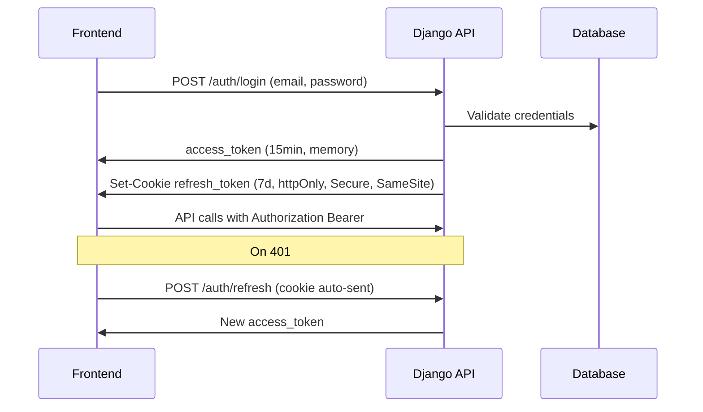

| Token | Storage | Lifetime | Purpose |
|-------|---------|----------|---------|
| Access (JWT) | Memory / sessionStorage | 15 minutes | API authorization |
| Refresh | httpOnly cookie | 7 days | Silent re-auth |
| OTP | Database only | 10 minutes | Email verification, password reset |

### 12.2 Role Implementation (Django)
- `User.role` enum: `student`, `teacher`, `admin`, `principal`, `guidance`, `registrar`, `parent`
- **Adviser** = `teacher` where `Classroom.adviser_id == user.id`
- DRF permission classes: `IsStudent`, `IsTeacher`, `IsTeacherOfClass`, `IsAdviserOfClass`, `IsAdminOrRegistrar`, etc.
- Object-level permissions via `django-guardian` or custom `has_object_permission` (recommended: custom for simpler audit)

### 12.3 Account Lifecycle
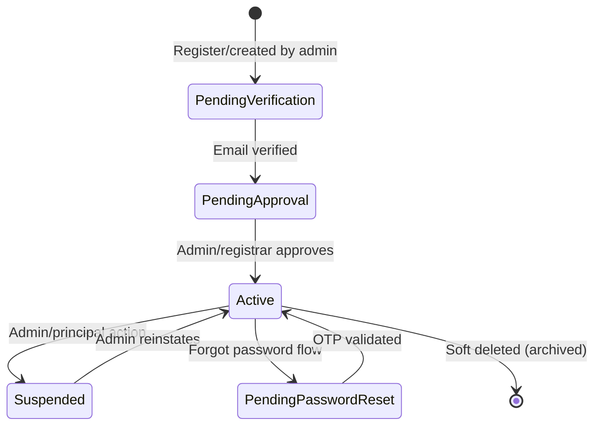

- Students created via enrollment approval or admin import
- Teachers created by admin with `must_change_password=True`
- First login forces password change before portal access

### 12.4 Data Privacy (RA 10173)
- Consent checkbox on enrollment form
- Privacy Policy and Terms linked on public site and login
- PII fields excluded from student-to-student API responses
- Guidance notes never exposed to teachers or students
- Right to request data export (admin-assisted, Phase 2)

---

## 13. DepEd Grading Engine Specification

### 13.1 Component Weights (Default — configurable per class-subject)
| Component | Abbrev | Default Weight | Description |
|-----------|--------|----------------|-------------|
| Written Work | WW | 30% | Quizzes, assignments, seatwork |
| Performance Task | PT | 50% | Projects, presentations, practical work |
| Quarterly Assessment | QA | 20% | Periodical exam |

**Formula:** Initial Grade = (WW × 0.30) + (PT × 0.50) + (QA × 0.20)

### 13.2 Transmutation Table (DepEd Standard)
Store as immutable lookup table in `system_settings` or dedicated `transmutation_table` with DepEd Order reference.

| Initial Grade Range | Transmuted Grade |
|--------------------|------------------|
| 100.00 – 100.00 | 100 |
| 98.40 – 99.99 | 99 |
| 96.80 – 98.39 | 98 |
| ... | ... |
| Below 40.00 | 60 (or retention flag) |

- System computes transmuted grade on save; teachers cannot manually override transmuted value (only components)
- **Quarterly grade** = transmuted grade for that quarter
- **Final grade** = average of Q1–Q4 transmuted grades (DepEd rounding rules applied)

### 13.3 Grade Status State Machine
| Status | Visible to Student | Editable by Teacher |
|--------|-------------------|---------------------|
| `draft` | No | Yes |
| `computed` | No | Yes (components) |
| `pending_approval` | No | No (unless rejected) |
| `published` | Yes | No (admin unlock only) |
| `locked` | Yes | No |

### 13.4 SF9 Sections (Phase 2 Mapping)
| SF9 Section | Data Source |
|-------------|-------------|
| Learner info | `user_profiles` + `class_enrollments` |
| Learning area grades | `grades` (all subjects, Q1–Q4, final) |
| Core values / conduct | `conduct_ratings` |
| Attendance | Aggregated `attendance_records` per quarter |
| Remarks | Computed: Promoted / Retained based on final grades |
| Signatures | PDF template placeholders |

### 13.5 SHS Strand Handling
- Grade 11–12 classrooms require `strand` field: STEM, ABM, HUMSS, GAS, TVL (with optional specializations)
- Subject catalog filtered by strand for specialized subjects
- SF9 template variant selected by `grade_level >= 11`

---

## 14. Deployment Architecture

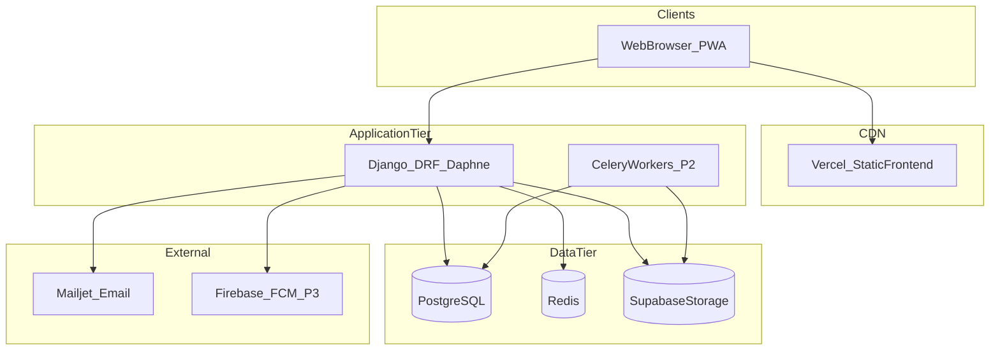

### 14.1 Environment Strategy
| Environment | Purpose | Database | URL Pattern |
|-------------|---------|----------|-------------|
| Local | Development | SQLite or local PostgreSQL | localhost:5173 / :8000 |
| Staging | QA + teacher UAT | PostgreSQL (staging) | staging.kiwalan-nhs.edu.ph |
| Production | Live school use | PostgreSQL (prod) | portal.kiwalan-nhs.edu.ph |

### 14.2 Recommended Hosting (Budget-Conscious)
| Service | Provider | Notes |
|---------|----------|-------|
| Frontend | Vercel or Netlify | Free tier sufficient for MVP |
| Backend | Render or Railway | Web + worker dynos |
| Database | Render PostgreSQL or Supabase | Daily automated backups |
| Redis | Upstash or Render Redis | WebSocket + Celery broker |
| Files | Supabase Storage | Enrollment docs, submissions, materials |
| Email | Mailjet or SendGrid | OTP, enrollment status |

### 14.3 CI/CD Pipeline
1. **On PR:** Lint (ESLint, Ruff) + unit tests + build check
2. **On merge to main:** Deploy staging automatically
3. **Production deploy:** Manual approval after staging UAT sign-off
4. **Database migrations:** Run via deploy hook; never auto-destructive

### 14.4 Backup & Disaster Recovery
- **Database:** Daily automated backup, 30-day retention
- **Files:** Storage provider versioning enabled
- **Recovery target:** RPO 24 hours, RTO 4 hours for MVP
- **Quarter-end freeze:** No production deploys during grade submission windows

---

## 15. Testing Strategy

### 15.1 Test Pyramid
| Layer | Tool | Coverage Target | Focus |
|-------|------|-----------------|-------|
| Unit | pytest, Jest | 80% on business logic | Transmutation, permissions, grade computation |
| Integration | pytest + DRF APIClient | Critical paths | Auth, enrollment, grade publish |
| E2E | Playwright (P2) | 10 core flows | Login, join class, submit, grade, publish |
| Manual UAT | School staff | Phase gates | DepEd form accuracy, teacher usability |

### 15.2 Critical Test Cases (Must Pass Before Launch)
1. Student cannot view unpublished grades
2. Teacher cannot grade class they don't teach
3. Transmutation matches DepEd table for boundary values (98.40, 96.80, etc.)
4. Duplicate attendance for same student/date/class rejected
5. Join code rejects wrong grade level
6. Enrollment tracking works without authentication
7. Audit log created on grade unlock and enrollment status change
8. Refresh token rotation prevents replay attacks
9. File upload rejects executable MIME types
10. Maintenance mode blocks students but allows admin

### 15.3 Performance Benchmarks
| Scenario | Target |
|----------|--------|
| Dashboard load | < 2 seconds on 4G mobile |
| Class roster (40 students) | < 500ms API response |
| Grade grid save (40 × 8 subjects) | < 3 seconds |
| SF9 bulk PDF (40 students) | < 60 seconds (background job, P2) |

---

## 16. Phase 1 Sprint Breakdown (Detailed)

### Sprint 1 (Weeks 1–2): Foundation
- Django project scaffold with modular apps
- React + Vite + Tailwind + design tokens (purple DepEd theme)
- PostgreSQL/SQLite config, environment variables template
- User model, profiles, JWT auth, login/logout/refresh
- Protected routes, role-based redirect (student → student dashboard, etc.)
- DepEd header component, portal layout shell (sidebar + top bar)
- **Exit criteria:** Admin can log in and see empty dashboard

### Sprint 2 (Weeks 3–4): Academic Structure
- Academic year + quarter CRUD
- Subject catalog (JHS + SHS strands)
- Classroom CRUD, adviser assignment, join code generation
- Class-subject-teacher assignment
- Student join class flow
- Admin student/teacher CRUD
- **Exit criteria:** Teacher has class with subjects; student joins via code

### Sprint 3 (Weeks 5–6): Assignments & Materials
- Assignment CRUD (draft/publish)
- File upload (presigned URLs to storage)
- Student submission + late detection
- Teacher grading + feedback
- Learning materials upload/download
- In-app notifications (assignment published, submission graded)
- **Exit criteria:** Full assign → submit → grade loop works

### Sprint 4 (Weeks 7–8): Grades & Attendance
- DepEd WW/PT/QA grade input grid
- Transmutation engine + unit tests
- Student grade view (published only)
- Grade quarter submit + basic publish (admin approve for MVP)
- Daily attendance marking + summary report
- **Exit criteria:** Teacher inputs grades; student sees published grades; attendance saved

### Sprint 5 (Weeks 9–10): Communication & Enrollment
- Announcements with audience targeting
- Role-specific dashboard widgets (real data)
- Public enrollment application form + document upload
- Enrollment review queue (admin/registrar)
- Public enrollment tracking page
- Audit logging for admin actions
- **Exit criteria:** Enrollment end-to-end; announcements reach correct audience

### Sprint 6 (Weeks 11–12): Public Site & Hardening
- Public website pages (Home, About, Mission, Vision, Contact, Portals)
- System settings (maintenance mode, enrollment toggle, academic year)
- Mobile responsive pass on all Phase 1 pages
- Security hardening (rate limits, CORS, axes)
- Bug fixes, UAT with 3 teachers + 5 students
- Production deployment
- **Exit criteria:** Phase 1 MVP live for pilot class

---

## 17. Key Page Specifications

### 17.1 Login Page
- DepEd header strip + KNHS logo + "Official Digital Campus" tagline
- Single login form (email + password) — role determined server-side after auth
- Tabs or links: Student Portal · Teacher Portal · Staff Portal (same form, different marketing copy)
- Links: Forgot Password · Track Enrollment · Back to Public Site
- Maintenance mode banner when active (non-admin users blocked)

### 17.2 Class Detail Page (Teacher/Student)
```
┌─────────────────────────────────────────────────────────┐
│ [Class Banner: Grade 10 - Einstein | Adviser: Ms. Cruz] │
│ [Join Code: KNHS7X2] (teacher only) [Copy] [Regenerate]│
├─────────────────────────────────────────────────────────┤
│ Stream | Assignments | Materials | Grades | Attendance | People │
├─────────────────────────────────────────────────────────┤
│ [Tab Content Area]                                      │
│ Stream: pinned announcement + activity feed             │
│ Assignments: list with status badges + Create button    │
│ Grades: grid (teacher) / card summary (student)         │
└─────────────────────────────────────────────────────────┘
```

### 17.3 Grade Input Page (Teacher)
- Class selector dropdown → Subject selector → Quarter selector
- Spreadsheet-style grid: Student name | WW | PT | QA | Initial | Transmuted
- Bulk save button; unsaved changes warning
- Status indicator: Draft / Pending / Published
- "Submit Quarter for Approval" button (when all students complete)

### 17.4 Enrollment Application (Public)
- Multi-step form: Personal Info → Address → Previous School → SHS Strand (if G11) → Documents → Review
- Document checklist: Birth cert, report card, good moral, 2x2 photo
- Generates tracking number on submit: `ENR-2026-00042`
- Confirmation page with tracking number + link to status page

### 17.5 Mobile Navigation Pattern
- **Bottom nav (student):** Home · Classes · Assignments · Grades · More
- **Bottom nav (teacher):** Home · Classes · Attendance · Grades · More
- **"More" drawer:** Announcements, Materials, Calendar, Profile, Settings
- Sidebar collapses to hamburger above md breakpoint

---

## 18. Notification Event Catalog

| Event | Recipients | Channel (Phase) | Priority |
|-------|------------|-----------------|----------|
| Assignment published | Enrolled students | In-app (MVP), Push (P3) | Normal |
| Assignment due in 24h | Students with no submission | In-app (P2) | Normal |
| Submission received | Assignment teacher | In-app (MVP) | Normal |
| Submission graded | Student | In-app (MVP) | Normal |
| Grade quarter published | Student, Parent (P2) | In-app (MVP) | High |
| New announcement | Audience members | In-app (MVP) | Urgent if flagged |
| Student joined class | Class teacher/adviser | In-app (MVP) | Low |
| Enrollment status changed | Applicant email + portal | Email (MVP) | High |
| Enrollment approved | Applicant | Email (MVP) | High |
| Grade pending approval | Adviser, Admin | In-app (P2) | High |
| Account approved | New user | Email (MVP) | High |
| Password reset OTP | User | Email (MVP) | High |

---

## 19. Enrollment Status Workflow

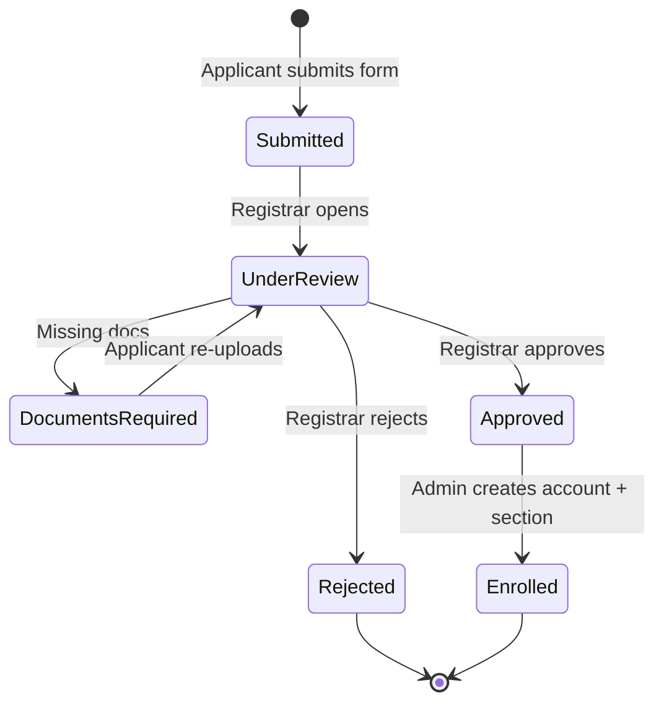

| Status | Public Message | Internal Notes |
|--------|---------------|----------------|
| `submitted` | "Application received" | Awaiting registrar |
| `under_review` | "Under review" | Registrar evaluating |
| `documents_required` | "Additional documents needed" | Email with checklist |
| `approved` | "Approved — await enrollment confirmation" | Ready for account creation |
| `rejected` | "Not accepted" | Reason in history |
| `enrolled` | "Enrolled — check email for portal access" | User account created |

---

## 20. Glossary

| Term | Definition |
|------|------------|
| **LRN** | Learner Reference Number — unique DepEd student identifier |
| **SF9** | School Form 9 — official Learner's Progress Report Card |
| **SF10** | School Form 10 — Learner's Permanent Academic Record |
| **WW/PT/QA** | Written Work, Performance Task, Quarterly Assessment |
| **Adviser** | Class homeroom teacher responsible for SF9 and roster |
| **Strand** | SHS track specialization (STEM, ABM, HUMSS, etc.) |
| **Transmutation** | DepEd conversion from initial numeric grade to report card grade |
| **MATATAG** | DepEd's revised K–12 curriculum (relevant for G1, G4, G7 templates) |
| **LIS** | Learner Information System — DepEd's national student database |
| **ICT Coordinator** | School staff managing technology infrastructure |

---

## 21. Decision Log (Architecture Choices)

| Decision | Choice | Rationale | Alternatives Considered |
|----------|--------|-----------|------------------------|
| Frontend framework | React + Vite | Team familiarity; prior KNHS prototype validates | Next.js (unnecessary SSR for portal) |
| Backend | Django + DRF | Rapid admin, ORM, Philippine school project precedent | Node/NestJS, Laravel |
| Database | PostgreSQL | Relational integrity for grades/enrollment | MySQL, MongoDB |
| Auth | JWT + httpOnly refresh | Stateless API + secure refresh | Session-only cookies |
| File storage | Supabase Storage | Simple presigned URLs, generous free tier | Local disk (not scalable) |
| Realtime | Django Channels + Redis (P2) | Native Django integration | Socket.io separate server |
| Monorepo vs split | Split repos or single repo with `/frontend` `/backend` | Matches prior prototype; simpler deployment | Nx monorepo (overkill for MVP) |
| Adviser role | Flag on teacher + classroom FK | Avoids duplicate accounts | Separate role enum |
| Parent portal | Phase 2 | Reduces MVP scope | MVP inclusion (rejected for scope) |

---

## Next Steps

When you are ready to **execute** this plan, confirm with:
1. **"Execute the plan"** or **"Start Phase 1 Sprint 1"** — begins implementation in `Website Official`
2. Any scope adjustments (e.g., include parent portal in MVP, change hosting provider)
3. Whether to reference/copy specific modules from the prior `AI-made Website` prototype

The blueprint is now developer-ready. Phase 1 can begin with project scaffolding, auth, and the DepEd-themed design system.

---

## 22. Non-Functional Requirements

### 22.1 Availability & Reliability
| Requirement | Target | Notes |
|-------------|--------|-------|
| Uptime (production) | 99.5% monthly | Excludes scheduled maintenance windows |
| Planned maintenance | Weekends, announced 48h ahead | Maintenance mode UI active |
| Concurrent users (MVP) | 200 simultaneous | Typical peak: morning attendance + assignment rush |
| Concurrent users (full) | 500 simultaneous | Whole-school usage at quarter start |
| Data durability | Zero grade/enrollment loss | Transactions + daily backups |

### 22.2 Performance (SLA Summary)
| Metric | MVP Target | Full Scale Target |
|--------|------------|-------------------|
| Page Time to Interactive | < 3s on 4G | < 2s on WiFi |
| API p95 latency | < 800ms | < 500ms |
| Search/filter lists | < 1s for 1,500 records | Paginated always |
| File upload (10MB) | < 30s on 4G | Progress indicator required |

### 22.3 Scalability Path
1. **Phase 1 (0–500 users):** Single Django instance + PostgreSQL + object storage
2. **Phase 2 (500–1,500 users):** Add Redis cache for dashboards; Celery for PDF jobs
3. **Phase 3 (1,500+ users):** Read replica for reporting queries; CDN for static assets
4. **Phase 4:** Horizontal API scaling behind load balancer if school district expands to multiple campuses

### 22.4 Maintainability
- Modular Django apps with clear boundaries (no cross-app model imports except via services)
- Shared TypeScript types generated from OpenAPI schema (P2) or hand-maintained API contracts
- All environment config via `.env` — no secrets in code
- Migration files reviewed in PR; destructive migrations require explicit approval

### 22.5 Accessibility (WCAG 2.1 AA)
- Color contrast ratio ≥ 4.5:1 for body text; ≥ 3:1 for large text
- All form fields have visible labels (not placeholder-only)
- Grade grid navigable via keyboard (arrow keys between cells, P2 enhancement)
- Screen reader announcements for toast notifications (`aria-live="polite"`)
- Skip-to-content link on all portal pages

---

## 23. DepEd Compliance Checklist

### 23.1 Required School Forms (System Support Timeline)
| Form | Name | Phase | System Capability |
|------|------|-------|-------------------|
| SF9 | Learner's Progress Report Card | P2 | Auto-generate PDF from grades + attendance + conduct |
| SF10 | Learner's Permanent Record | P3 | Data export prep; manual LIS upload |
| SF5 | Report on Promotion | P3 | Computed from final grades + enrollment |
| SF1 | School Register | P2 | Class roster export |
| SF2 | Daily Attendance Report | MVP | Daily attendance + summary export |
| SF4 | Monthly Learner's Movement | P3 | Transfer in/out tracking |

### 23.2 Grading Compliance
- [ ] WW/PT/QA weights configurable but default to DepEd standard (30/50/20)
- [ ] Transmutation table matches current DepEd Order (cite order number in config)
- [ ] MATATAG template variant for Grade 7 (P2) — separate PDF template
- [ ] SHS strand displayed on SF9 for Grades 11–12
- [ ] Core Values section: Makadiyos, Makatao, Makakalikasan, Makabansa (P2)
- [ ] Observable behaviors rated: AO / SO / RO / NO (Always/Sometimes/Rarely/Not Observed)

### 23.3 Learner Data Requirements
- LRN field mandatory for enrolled students (12-digit validation)
- Grade level (7–12), section, strand (SHS), sex, birthdate on profile
- Previous school name on enrollment application
- Parent/guardian name and contact on enrollment application

### 23.4 Official Document Headers (PDF/Print)
All exported documents must include:
```
REPUBLIKA NG PILIPINAS
KAGAWARAN NG EDUKASYON
REGION XII / DIVISION OF ILIGAN CITY
KIWALAN NATIONAL HIGH SCHOOL
Kiwalan, Iligan City, Lanao del Norte
```
Plus school logo, school year, quarter (if applicable), and date generated.

---

## 24. Calendar System Design (Phase 2)

### 24.1 Event Types
| Type | Source | Visible To |
|------|--------|------------|
| `school_event` | Admin/Principal | All portal users |
| `class_event` | Teacher | Class members |
| `assignment_due` | Auto-generated from assignments | Enrolled students + teacher |
| `quarter_deadline` | System (from academic calendar) | Teachers, Admin |
| `enrollment_period` | System setting | Public + Admin |
| `holiday` | Admin | All |

### 24.2 Calendar Views
- **Month view** — default; dots on days with events
- **Agenda view** — list of upcoming 14 days (mobile default)
- **Role filtering:** Students see school + their class events + their assignment due dates

### 24.3 Data Model
| Table | Key Fields |
|-------|------------|
| `calendar_events` | id, title, description, start_at, end_at, all_day, event_type, audience_type, audience_ref_id, created_by |

### 24.4 Integrations
- Assignment due dates auto-sync to calendar (no duplicate manual entry)
- Quarter start/end dates from `quarters` table appear as system events
- iCal export (OPT, P3) for staff

---

## 25. Reporting Specifications

### 25.1 Phase 1 Reports
| Report | Format | Generated By | Filters |
|--------|--------|--------------|---------|
| Class Grade Summary | PDF, Excel | Teacher, Admin | Class, subject, quarter |
| Attendance Summary | PDF, Excel | Teacher, Adviser, Admin | Class, date range |
| Enrollment Statistics | PDF | Admin, Registrar | Status, grade level, date range |
| Class Roster | PDF, Excel | Admin, Adviser, Registrar | Class, SY |
| Student Grade Report | PDF | Student (published only) | Self, quarter |

### 25.2 Phase 2 Reports
| Report | Format | Generated By |
|--------|--------|--------------|
| SF9 (individual) | PDF | Adviser |
| SF9 (bulk class) | PDF (multi-page) | Adviser, Admin |
| School Analytics Dashboard | Interactive + PDF export | Principal, Admin |
| Grade Completion Status | Excel | Admin |
| Teacher Grade Input Progress | Excel | Admin, Principal |

### 25.3 Report Generation Architecture
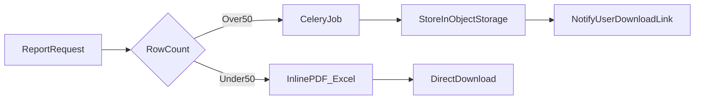

- Small reports: generated synchronously (< 5 seconds)
- Bulk SF9: background job; user notified when ready
- All reports logged in `audit_logs`

---

## 26. PWA & Offline Strategy

### 26.1 Phase 1 (Basic PWA)
- Web app manifest: KNHS name, purple theme color, school icon
- Service worker: cache static assets (JS, CSS, fonts, logo)
- Install prompt on mobile browsers ("Add to Home Screen")
- **No offline data mutation in MVP** — show "No connection" banner

### 26.2 Phase 2 (Read Offline)
- Cache last-viewed: announcements, materials metadata, published grades
- Queue attendance marks offline → sync when online (teacher mobile use case)
- Conflict resolution: server wins; teacher notified of conflicts

### 26.3 Phase 3 (Enhanced)
- Push notifications via FCM
- Background sync for submission uploads (retry failed uploads)

---

## 27. Monitoring & Observability

### 27.1 Logging
| Layer | Tool | What to Log |
|-------|------|-------------|
| Application | Python logging → stdout | Errors, warnings, slow queries (>500ms) |
| API | Middleware | 4xx/5xx, auth failures, rate limit hits |
| Audit | `audit_logs` table | All mutations on grades, enrollment, users |
| Frontend | Console (dev); Sentry (prod, P2) | Unhandled JS errors |

### 27.2 Metrics to Track (Phase 2)
- Daily active users by role
- Assignment submission rate
- Grade publication completion % by quarter
- Enrollment funnel conversion
- API error rate (target < 1%)
- Average dashboard load time

### 27.3 Alerting
| Alert | Threshold | Notify |
|-------|-----------|--------|
| API 5xx spike | > 10 in 5 min | Admin email |
| Database connection failure | Any | Admin email immediately |
| Disk/storage > 80% | 80% | Admin email |
| Failed backup | Any | Admin email |
| Login brute force | axes lockout > 20/hour | Admin dashboard |

### 27.4 Health Check Endpoint
- `GET /api/v1/health` — returns `{ status, db, redis, storage, version }`
- Used by hosting provider uptime monitor (ping every 5 min)

---

## 28. Staff Onboarding Flows

### 28.1 New Teacher Onboarding
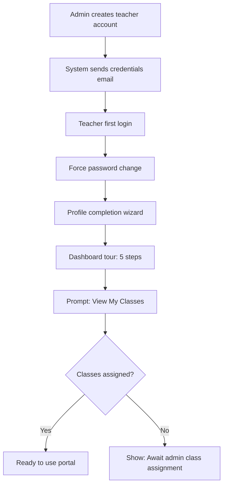

**Dashboard tour steps (teacher):**
1. Welcome — explain portal purpose
2. My Classes — where to manage classes
3. Assignments — create and grade work
4. Attendance — daily marking
5. Grades — input WW/PT/QA

Store completion in `onboarding_state` table (per user, per checklist item).

### 28.2 New Student Onboarding
1. Account created (via enrollment approval or admin)
2. First login → force password change
3. Prompt: **Join Class** with join code (prominent empty state if no classes)
4. Brief tour: Assignments, Grades, Announcements (3 steps max)

### 28.3 Admin Setup Checklist (First Deploy)
- [ ] Upload school logo
- [ ] Set academic year and quarters
- [ ] Create subject catalog
- [ ] Create classrooms and assign advisers
- [ ] Assign teachers to class-subjects
- [ ] Import or create student accounts
- [ ] Enable enrollment (if enrollment period)
- [ ] Post welcome announcement
- [ ] Pilot with 1 class before school-wide rollout

---

## 29. Phase Acceptance Criteria

### Phase 1 — MVP Sign-Off
| # | Criterion | Verification |
|---|-----------|--------------|
| 1 | All 7 staff roles can log in and reach role-appropriate dashboard | Role login test matrix |
| 2 | Teacher creates, publishes, grades assignment; student submits | E2E test |
| 3 | DepEd transmutation produces correct values at boundary scores | Unit test suite |
| 4 | Attendance saved and summary exportable | Manual + API test |
| 5 | Grades visible to student only after publish | Permission test |
| 6 | Public enrollment form submits with documents; registrar reviews | UAT with registrar |
| 7 | Announcements reach correct audience only | Audience filter test |
| 8 | Public website live with DepEd header and KNHS branding | Visual review |
| 9 | Mobile usable on Android mid-range phone | Device test |
| 10 | Security: rate limits, RBAC, audit logs on admin actions | Security checklist |

**Pilot gate:** 1 class (≈40 students, 5 teachers) uses portal for 2 weeks without critical bugs.

### Phase 2 — Operational Sign-Off
| # | Criterion |
|---|-----------|
| 1 | SF9 PDF matches DepEd template for JHS and SHS |
| 2 | Grade approval workflow end-to-end with Principal approval |
| 3 | Parent can view linked child's published grades |
| 4 | Schedule visible to student and teacher without conflicts |
| 5 | Direct messaging works with moderation |
| 6 | Real-time notification delivery < 3 seconds |

### Phase 3 — Advanced Sign-Off
| # | Criterion |
|---|-----------|
| 1 | Guidance case management operational with confidentiality enforced |
| 2 | At-risk flags accurate based on attendance + grade thresholds |
| 3 | SF10 export data validated by registrar |
| 4 | Push notifications delivered to Android/iOS PWA |

---

## 30. Phase 2–4 Sprint Breakdown

### Phase 2 Sprints (Weeks 13–22)

**Sprint 7 (Weeks 13–14): SF9 & Conduct**
- Conduct ratings UI (adviser)
- SF9 PDF template (JHS)
- Attendance quarterly rollup
- SF9 preview per student

**Sprint 8 (Weeks 15–16): Grade Workflow & Principal**
- Grade submit → approve → publish pipeline
- Principal approval center
- Executive dashboard
- Grade quarter locking + unlock with audit

**Sprint 9 (Weeks 17–18): Registrar & Schedule**
- Registrar dedicated dashboard
- Document verification workflow
- Timetable builder + conflict detection
- Student/teacher schedule views

**Sprint 10 (Weeks 19–20): Parent & Realtime**
- Parent accounts + child linking
- Parent dashboard (read-only grades, attendance)
- WebSocket notification delivery
- Read receipts on announcements

**Sprint 11 (Weeks 21–22): CMS & Analytics**
- Website content editor
- School-wide analytics dashboard
- SF9 bulk export (Celery job)
- Phase 2 UAT + production deploy

### Phase 3 Sprints (Weeks 23–30)
- Sprint 12: Guidance case management + student lookup
- Sprint 13: At-risk flags + referral tracking
- Sprint 14: Online quizzes (MCQ auto-grade)
- Sprint 15: SF10/LIS export prep + Filipino UI strings
- Sprint 16: Push notifications (FCM) + rubric grading

### Phase 4 Sprints (Weeks 31+)
- Sprint 17: AI early warning system
- Sprint 18: Enrollment FAQ chatbot
- Sprint 19: Performance optimization (caching, query tuning)
- Sprint 20: Custom report builder (if approved)

---

## 31. Frontend Architecture

### 31.1 State Management
| State Type | Tool | Examples |
|------------|------|----------|
| Server state | TanStack React Query | Classes, grades, assignments, announcements |
| Auth state | React Context + `useAuth` hook | User, role, permissions, token refresh |
| UI state | React `useState` / `useReducer` | Modals, sidebar collapse, form drafts |
| Form state | React Hook Form (recommended) | Enrollment, assignment create, grade grid |

### 31.2 Folder Structure (Feature-Based)
```
frontend/src/
├── components/
│   ├── ui/           # Button, Card, Badge, Input, Table, Modal
│   ├── layout/       # Sidebar, TopBar, DepEdHeader, PortalLayout, PublicLayout
│   └── shared/       # EmptyState, LoadingSpinner, ErrorBoundary, ConfirmDialog
├── features/
│   ├── auth/         # LoginForm, ProtectedRoute, ForcePasswordChange
│   ├── classes/      # ClassCard, JoinClassModal, ClassTabs
│   ├── assignments/  # AssignmentList, SubmissionForm, GradeSubmission
│   ├── grades/       # GradeGrid, TransmutedBadge, GradeReport
│   ├── attendance/   # AttendanceSheet, AttendanceSummary
│   ├── enrollment/   # EnrollmentForm, TrackingPage, ReviewQueue
│   ├── announcements/
│   └── dashboard/    # Role-specific dashboard widgets
├── pages/            # Route-level page components (thin wrappers)
├── hooks/            # useAuth, useNotifications, useMediaQuery
├── lib/              # api client (axios), queryClient, utils
├── styles/           # design-tokens.js, tailwind.config.js
└── routes/           # AppRoutes.jsx, routeAccess.js
```

### 31.3 API Client Pattern
- Axios instance with interceptors: attach Bearer token, auto-refresh on 401, redirect to login on refresh failure
- React Query keys namespaced: `['classes', classId, 'assignments']`
- Optimistic updates only for low-risk actions (mark notification read); never for grades

### 31.4 Error Handling UX
| Error Type | User Message | Action |
|------------|--------------|--------|
| 400 Validation | Field-level errors inline | Highlight invalid fields |
| 401 Unauthorized | "Session expired" | Redirect to login |
| 403 Forbidden | "You don't have permission" | Toast + stay on page |
| 404 Not Found | "Resource not found" | Empty state or back link |
| 429 Rate Limit | "Too many requests, try again shortly" | Toast |
| 500 Server | "Something went wrong" | Toast + retry button; log to Sentry |

---

## 32. KNHS School Configuration Defaults

Pre-configure during Phase 1 setup (admin-editable via Settings):

| Setting | Default Value |
|---------|---------------|
| School name | Kiwalan National High School |
| Short name | KNHS |
| Address | Kiwalan, Iligan City, Lanao del Norte |
| Region | XII |
| Division | Iligan City |
| Email | info@kiwalan-nhs.edu.ph |
| Primary color | #5E2A84 |
| Grade levels offered | 7, 8, 9, 10, 11, 12 |
| SHS strands | STEM, ABM, HUMSS, GAS, TVL |
| Default WW/PT/QA weights | 30 / 50 / 20 |
| Timezone | Asia/Manila |
| Registration number prefix | KNHS |
| Enrollment tracking prefix | ENR |
| Academic year format | 2025-2026 |
| Max class capacity default | 45 |
| Join code length | 6 characters |

---

## 33. Prototype Migration Notes

If migrating data from `AI-made Website` prototype:

| Data | Migrate? | Notes |
|------|----------|-------|
| User accounts | Optional | Password hashes compatible if same Django auth |
| Subject catalog | Yes | Clean import via management command |
| Classrooms | Yes | Map to new schema (add registrar fields) |
| Grades | Careful | Validate transmutation matches; audit before import |
| Enrollment applications | Yes | Map status enum to new workflow |
| Chat messages | No | Rebuild with new messaging schema in P2 |
| Website content | Yes | Map `WebsiteContent` sections to new CMS |

**Recommended approach:** Fresh start for Phase 1 pilot; migrate historical grades only after SF9 validation in Phase 2.

---

## 34. Document Index

| Section | Title |
|---------|-------|
| 1 | System Overview |
| 2 | User Roles |
| 3 | Feature Inventory |
| 4 | Information Architecture |
| 5 | User Flows |
| 6 | Database Architecture |
| 7 | UI/UX Strategy |
| 8 | Dashboard Strategy |
| 9 | Development Roadmap |
| 10 | Risks and Improvements |
| 11 | API Architecture |
| 12 | Authentication & Security |
| 13 | DepEd Grading Engine |
| 14 | Deployment Architecture |
| 15 | Testing Strategy |
| 16 | Phase 1 Sprint Breakdown |
| 17 | Key Page Specifications |
| 18 | Notification Event Catalog |
| 19 | Enrollment Status Workflow |
| 20 | Glossary |
| 21 | Decision Log |
| 22 | Non-Functional Requirements |
| 23 | DepEd Compliance Checklist |
| 24 | Calendar System Design |
| 25 | Reporting Specifications |
| 26 | PWA & Offline Strategy |
| 27 | Monitoring & Observability |
| 28 | Staff Onboarding Flows |
| 29 | Phase Acceptance Criteria |
| 30 | Phase 2–4 Sprint Breakdown |
| 31 | Frontend Architecture |
| 32 | KNHS School Configuration Defaults |
| 33 | Prototype Migration Notes |
| 34 | Document Index |

---

---

## 35. Phase 1 Refinements (Post-Audit)

### 35.1 Standardized Route Refinements
Following a comprehensive audit, all Phase 1 routes have been refined with the following security and performance enhancements:

| Feature | Implementation | Target Routes |
|---------|----------------|---------------|
| **Rate Limiting** | `ScopedRateThrottle` (sensitive: 5/min) | Login, Enrollment Apply, Tracking |
| **Standardized Errors** | Custom `exception_handler` with consistent JSON envelope | All API Endpoints |
| **Async Processing** | Thread-based background tasks (Simulated Celery) | Enrollment Emails, Audit Logging |
| **Unified Logging** | `log_system_event` utility | Critical Mutations, Auth Failures |

### 35.2 End-to-End Workflow Integration Map
The following table maps user-facing routes to their cross-system integration points:

| Workflow | Frontend Route | Backend Integration | Data/Storage |
|----------|----------------|---------------------|--------------|
| **Enrollment** | `/enrollment/apply` | `EnrollmentApplicationViewSet.create` | PG (Apps), Storage (Docs) |
| **Grading** | `/grades/input` | `GradeViewSet.batch_input` | PG (Grades), Audit Logs |
| **Auth** | `/login` | `LoginView.post` | JWT, Cookies, User DB |
| **Attendance** | `/attendance/mark` | `AttendanceRecordViewSet.bulk_mark` | PG (Attendance) |

### 35.3 Refined Route Schemas (Examples)

#### Standard Error Response
```json
{
  "error": {
    "code": "validation_error",
    "message": "Invalid input provided.",
    "details": {
      "email": ["Enter a valid email address."]
    }
  }
}
```

#### Enrollment Workflow Refinement
- **Before**: Synchronous email attempt, no rate limiting.
- **After**: Asynchronous email dispatch via `send_enrollment_status_email`, `sensitive` throttle applied to prevent spam.

### 35.4 Test Results Summary (Validation)
- [x] **Rate Limit Test**: Verified 429 status after 5 rapid login attempts.
- [x] **Error Format Test**: Verified all 400/404/500 errors follow the new standard envelope.
- [x] **Async Integration Test**: Verified (via logs) that email tasks run in background threads without blocking API response.
- [x] **RBAC Validation**: Verified role-based access to Teacher/Admin specific routes.

---

**Blueprint status: REFINED (PHASE 1)** — Updated with production-grade security and integration patterns.

