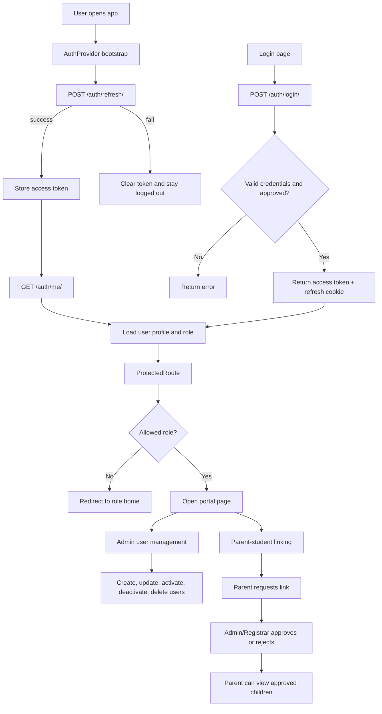
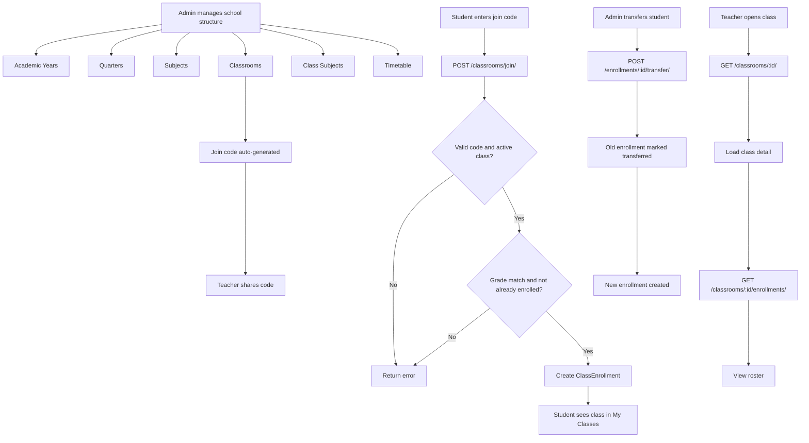
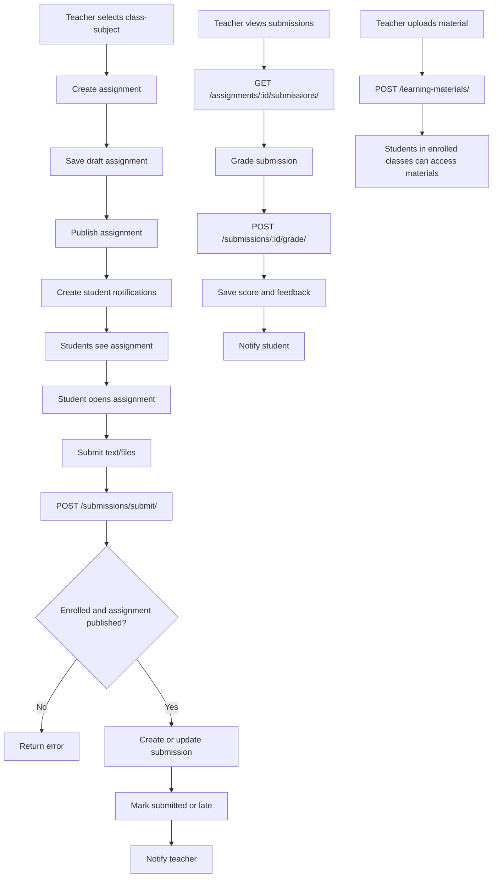
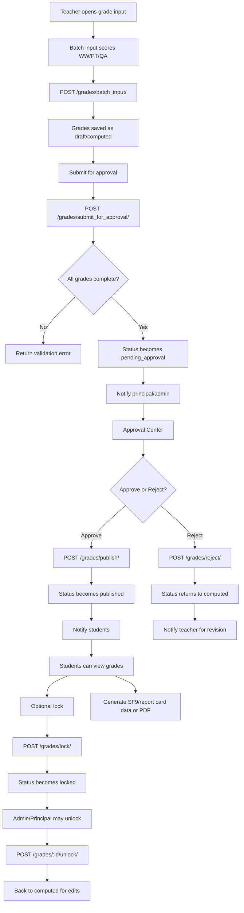
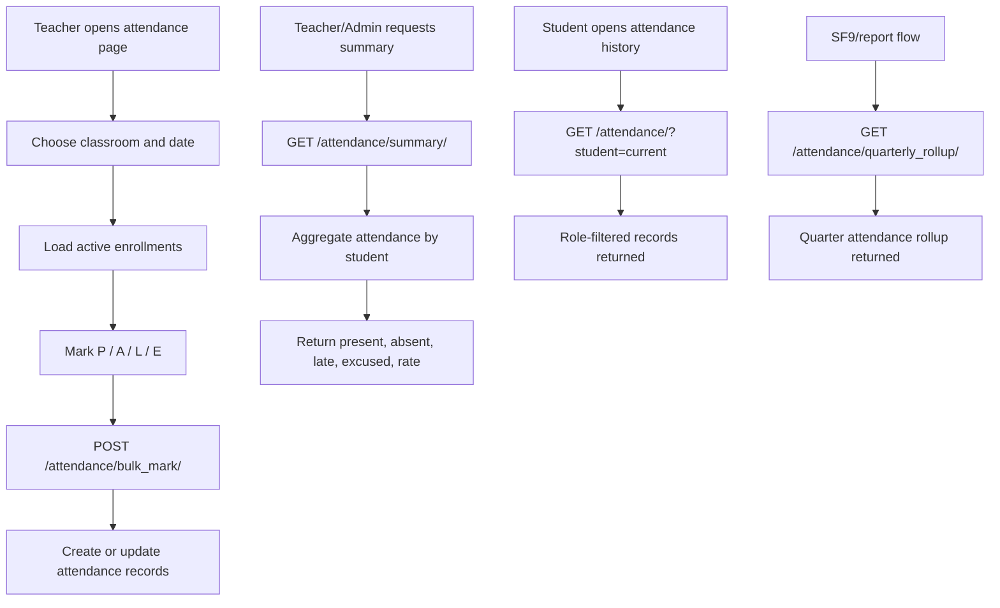
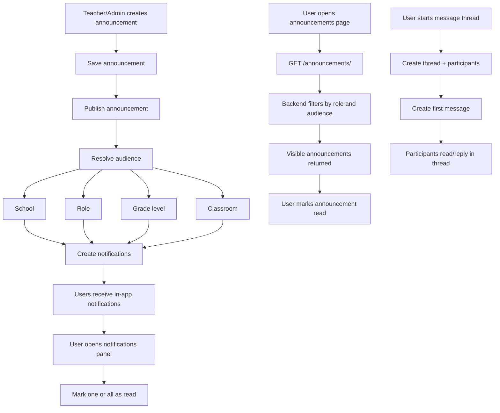
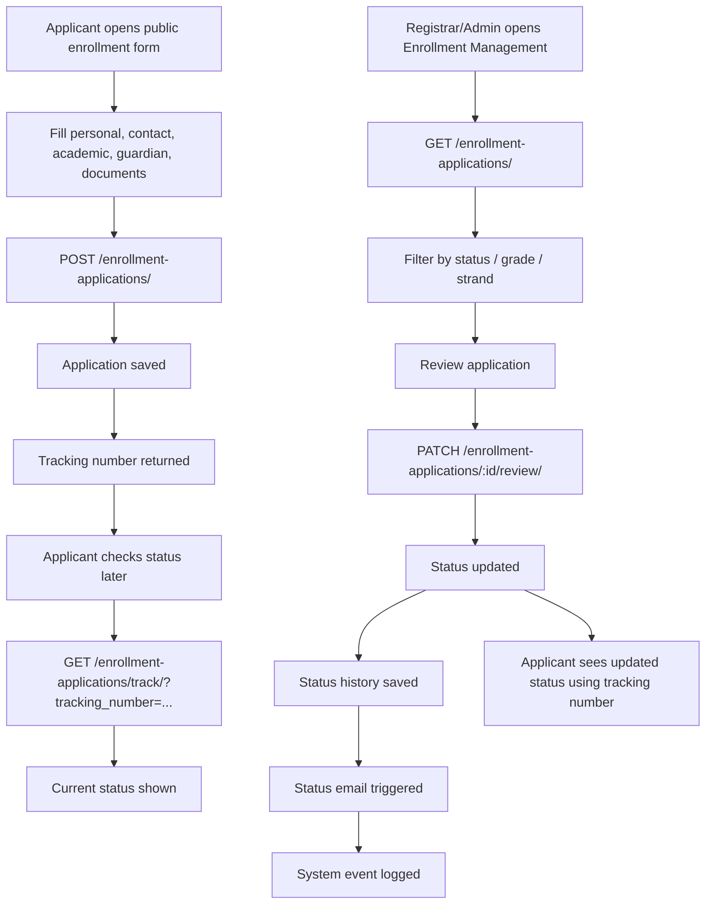
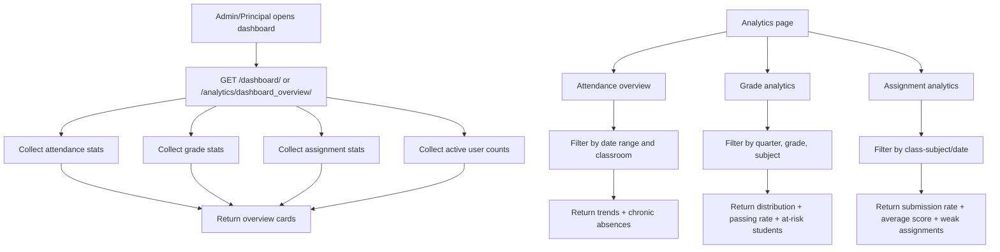
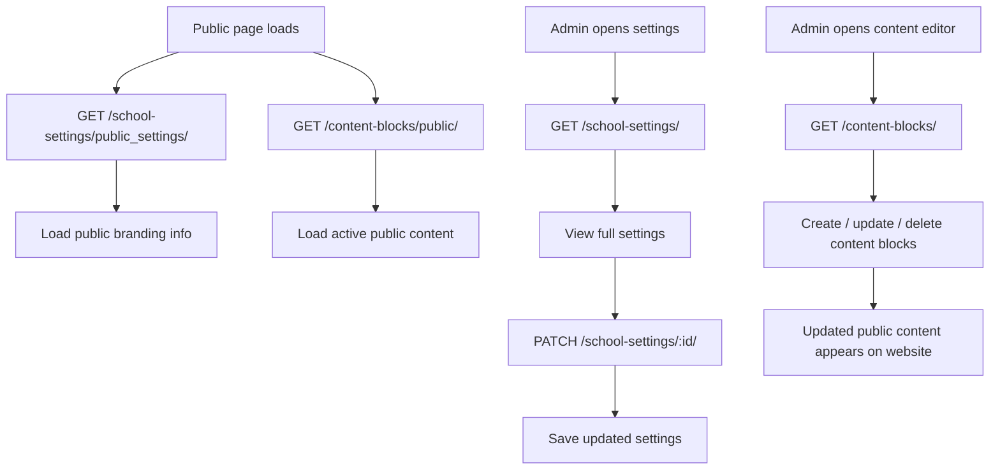
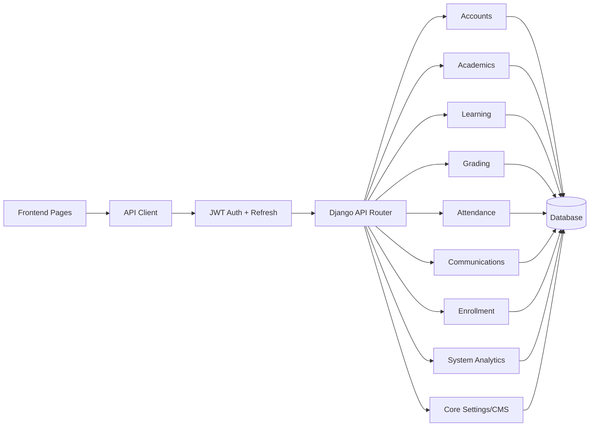

# System Flowcharts

Visual flowcharts for the major systems in the KNHS portal.

These diagrams use Mermaid syntax and can be viewed in Markdown renderers that support Mermaid.

## 1. Authentication and Accounts

## 2. Academic Structure

## 3. Learning System

## 4. Grading Workflow

## 5. Attendance System

## 6. Communications System

## 7. Enrollment System

## 8. Analytics and Dashboard System

## 9. Settings and CMS

## 10. Full Platform View

## Reference Files

- Frontend routing: `frontend/src/App.jsx`
- Auth flow: `frontend/src/features/auth/AuthContext.jsx`
- API client: `frontend/src/lib/api.js`
- Accounts: `backend/apps/accounts/views.py`
- Academics: `backend/apps/academics/views.py`
- Learning: `backend/apps/learning/views.py`
- Grading: `backend/apps/grading/views.py`
- Attendance: `backend/apps/attendance/views.py`
- Communications: `backend/apps/communications/views.py`
- Enrollment: `backend/apps/enrollment/views.py`
- Analytics/System: `backend/apps/system/views.py`
- Core settings/CMS: `backend/apps/core/views.py`
